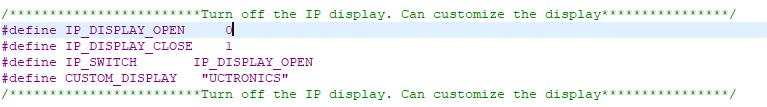

# pp1-odin


**Odin** is the DNS deity and VPN sentinel of my homelab, powered by a Raspberry Pi 4.

## 📁 Repo Structure

```text
pp1-Odin/
├── .github/workflows/      # CI for YAML validation
├── backup_logs/            # Oldest logs from update script
├── dockprom/               # Docker container(s) for Prometheus Node Exporter for RPi
├── images/                 # Images for README files
├── logs/                   # Most recent update script logs
├── scripts/                # Auto-Updater script for RPi (can be associated with cronjob)
├── U6143_ssd1306/          # Python, C code, and script for UCTronics display screen
└── README.md               # You're reading it!
```

---

## 🧰 Services
- **Pi-hole**: Blocks ads, trackers, and telemetry across the network.

---

## 🖥️ Installing U6143_ssd1306 Display

- Preparation

  - Install GIT (app used to download this repo onto your device)
  ```bash
  sudo apt install git -y
  ```

  - Download repo
  ```bash
  cd
  git clone https://github.com/OnyxJeff/pp1-odin.git
  ```

```bash
sudo raspi-config
```
Choose Interface Options Enable i2c

- Run setup_display_service.sh script
```bash
cd ~/pp1-odin/U6143_ssd1306
chmod +x setup_display_service.sh
sudo ./setup_display_service.sh
```

- Custom display temperature type
  - Open the U6143_ssd1306/C/ssd1306_i2c.h file. You can modify the value of the TEMPERATURE_TYPE variable to change the type of temperature displayed. (The default is Fahrenheit)
  

- Custom display IPADDRESS_TYPE type
  - Open the U6143_ssd1306/C/ssd1306_i2c.h file. You can modify the value of the IPADDRESS_TYPE variable to change the type of IP displayed. (The default is ETH0)
  

- Custom display information
  - Open the U6143_ssd1306/C/ssd1306_i2c.h file. You can modify the value of the IP_SWITCH variable to determine whether to display the IP address or custom information. (The custom IP address is displayed by default)
  

---

## ⚠️ Updating the OS

- Update and Upgrade the System via script:
```bash
cd ~/pp1-odin/scripts
chmod +x apt-get-autoupdater.sh
sudo ./apt-get-autoupdater.sh
```

- Start CronJob (optional but recommended if doing headless/always on installation)
```bash
sudo crontab -e
```

  - add the following to the bottom of the document:
  ```bash
  # OS-Auto-Updater
    00 01 * * 0 bash $HOME/pp1-odin/scripts/apt-get-autoupdater.sh
      # execute automatic update script and log every sunday at 01:00 am
    50 00 1 * * /bin/bash -c 'cp $HOME/pp1-odin/logs/apt-get-autoupdater.log $HOME/pp1-odin/backup_logs/apt-get-autoupdater-$(date +\%Y\%m\%d).log'
      # saves monthly version of "apt-get-autoupdater.log" on the 1st of every month at 00:50 am
    51 00 1 * * rm -f $HOME/pp1-odin/logs/apt-get-autoupdater.log
      # deletes old weekly log on the 1st of every month at 00:51 am
  ```

## 📦 Installing Docker Compose

- Install Docker
```bash
cd
curl -fsSL https://get.docker.com -o get-docker.sh
sudo sh get-docker.sh
```

- Add User to Docker Group
```bash
sudo usermod -aG docker $USER
```

> [!IMPORTANT]
> After running this command you will need to log out and log back in (or I recommend just rebooting) for the changes to take effect.

- Install Docker Compose:
```bash
sudo apt install docker-compose-plugin
```

- Verify Installation:
```bash
docker run hello-world
docker compose version
```

### 📝 Installing your first container(s)

- Installing Dockprom (Prometheus Exporter)
```bash
cd ~/pp1-odin/dockprom
docker compose up -d
```

---

## 🛡️ Pi-Hole


- Instal PiHole (Automated Install method)

```bash
bash ~/pp1-odin/scripts/pihole.sh
```

- Follow prompts on screen during installation of PiHole

Note: This will install the latest version of Pi-Hole.

- Make sure to change your DNS server in your router or PC to the IP address of Pi-Hole to utilize it.

---

## Acknowledgements

This project uses or is inspired by the following repositories:

- [U6143_ssd1306](https://github.com/UCTRONICS/U6143_ssd1306) – Provides the C display code used in the systemd service setup.
- [Dockprom](https://github.com/stefanprodan/dockprom) – Used for Docker-based Prometheus monitoring and metrics collection.
- [Pi-Hole](https://pi-hole.net/) – Provides PiHole instance for a custom DNS sinkhole that protects your devices from unwanted content, without installing any client-side software.

---

📬 Maintained By
Jeff M. • [@OnyxJeff](https://www.github.com/onyxjeff)